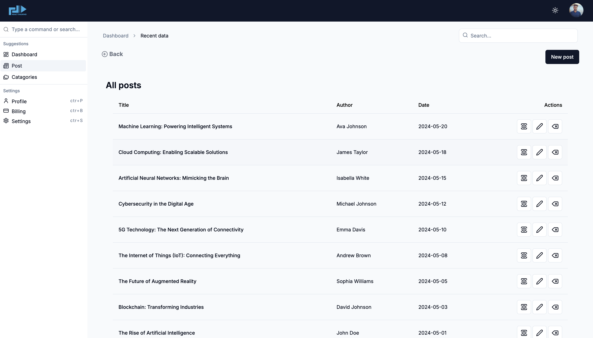
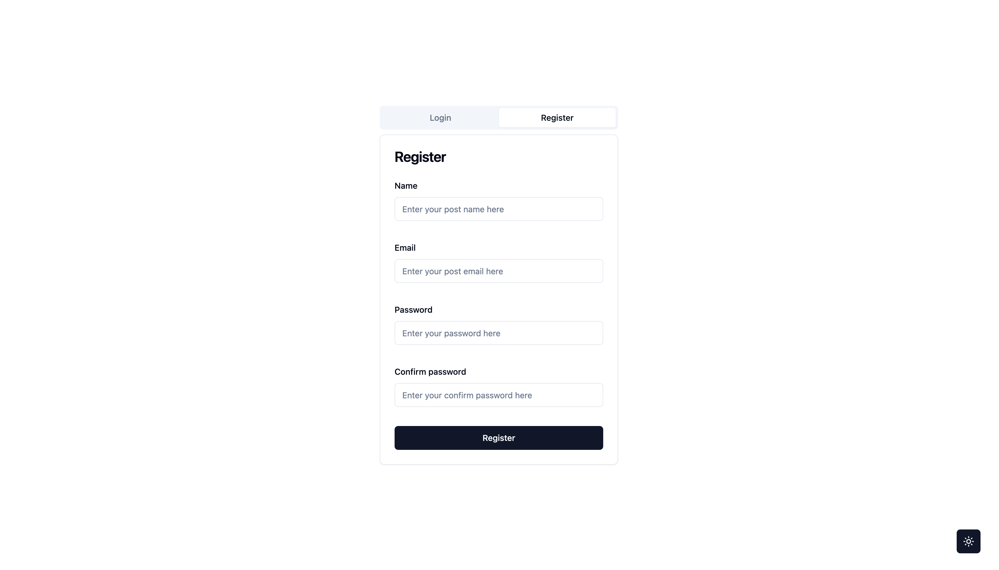

# Shadcn Blog Dashboard

Welcome to the Shadcn Blog Dashboard project! This dashboard is designed to provide a seamless experience for managing blog posts a, built with modern web technologies like Next.js, React, Tailwind CSS, and shadcn-ui

### Features

- Dark Mode: Toggle between light and dark themes to suit your preferences.
- Authentication: Secure user registration and sign-in with validation.
- Post Management:

1.  Create, edit, and delete blog posts.
2.  Use react-hook-form for efficient form handling.

- Analytics: charts to visualize blog data.
- Responsive Design: Fully responsive across all devices.
- UI/UX: Designed with shadcn-ui for a sleek, modern interface.

### Tech Stack

- Next.js: For server-side rendering and optimized performance.
- React: Component-based architecture for building the user interface.
- Tailwind CSS: Utility-first CSS framework for rapid UI development.
- shadcn-ui: Elegant and customizable UI components.
- React Hook Form: For managing form state and validation.

### Getting Started

1.

```bash
git clone https://github.com/Mortazasadat/shadcn_dashboard
cd shadcn-dashboard
```

2.

```bash
bun install
```

3.

```bash
bun run dev
```

### Screenshots





### Contributing

Contributions are welcome! Please feel free to submit a Pull Request or open an Issue.

### License

This project is licensed under the MIT License.
